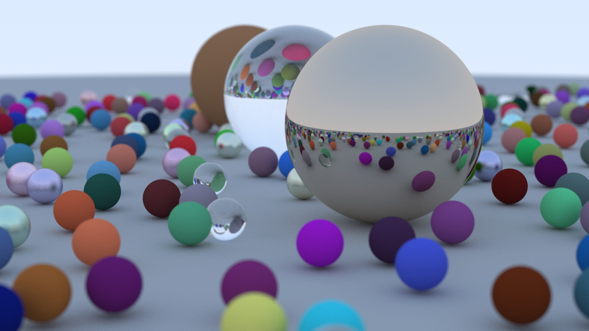

# Ray Tracer



## Overview

This project is a C++ Ray Tracer based on the book "Ray Tracing in One Weekend" by Peter Shirley. It uses CMake for build configuration and simulates the interaction of light with objects to create realistic images. The project includes features such as ray-object intersection, reflection and refraction, support for different materials, and configurable camera and lighting settings.

## Features

- **Ray-object intersection**: Calculates the intersection of rays with objects in the scene.
- **Reflection and refraction**: Simulates light reflecting and refracting through different materials.
- **Material properties**: Supports various materials with unique behaviors.
- **Configurable camera and lighting**: Allows customization of the camera position, orientation, and lighting.

## Installation

### Prerequisites

- C++ compiler (e.g., g++, msvc, clang)
- CMake (version 3.10 or higher)

### Steps

1. Clone the repository and navigate to the project directory:
    ```sh
    git clone https://github.com/Nathan-Romero/ray-tracer.git
    cd ray-tracer
    ```

2. Build the project using CMake:
    ```sh
    cmake -B build
    cmake --build build --config Release  # Create release binaries in `build\Release`
    ```

## Usage

After building the project, you can run the ray tracer executable to render an image. Below is an example of how to run the executable:

```sh
./ray-tracer > image.ppm
```

This command will run the ray tracer and output the rendered image to a PPM file named `image.ppm` in the project directory. You can convert the image into a JPG file, or you can use other image viewing software (e.g., XnView) to open it.
